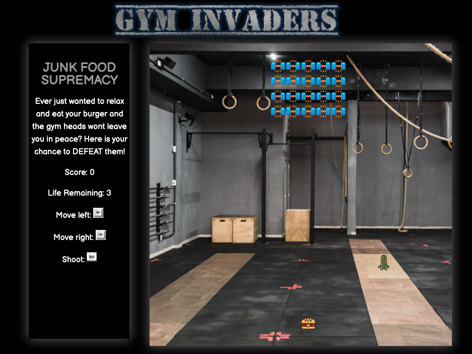
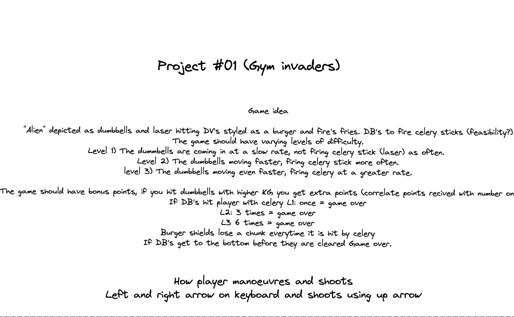
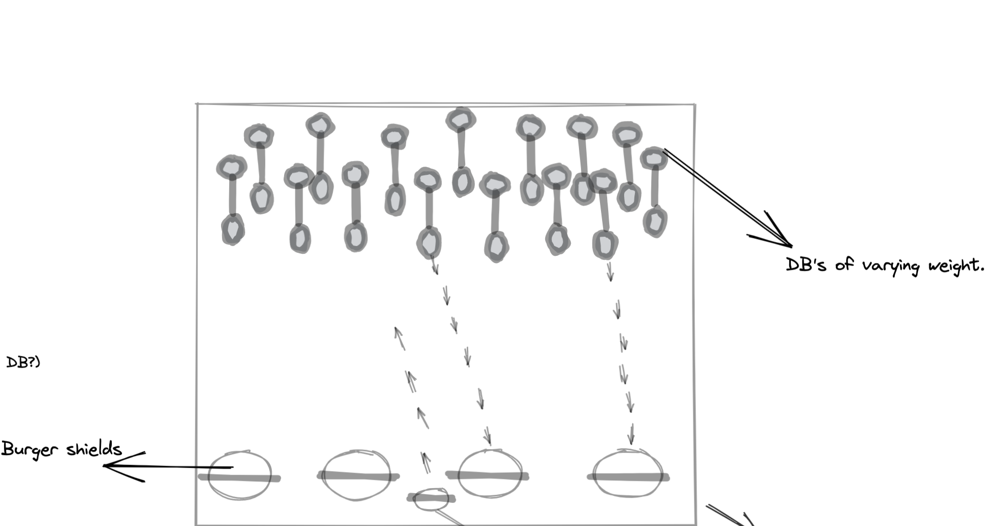

# Space Invaders 
### Overview

By applying the fundamentals of JavaScript, I embarked on my first project, which was a grid-based game.
Space Invaders is a classic arcade game where the player moves left or right and shoots at the invading aliens to gain points. The game ends when the player kills all the aliens, reaches a certain point or the aliens reach the bottom of the grid and “invade”.

My version of space invaders plays on my experience within the world of working out. The burger “unhealthy meal” is defending itself from the invading dumbbells.


### Deployment
The game is deployed to GitHub and can be played here: [Deployed Game](https://aromiafolabi.github.io/gym-invaders/)

### Getting Started
1. Access the source code via the 'Clone or download' button
2. Open the index.html file in your browser of choice to start the game

### Brief
The goal was to build a grid-based game using only JavaScript within a 5-day timeframe.

### Technologies used:
* HTML5
* CSS
* JavaScript
* GitHub

### Process
#### Planning
I began the process of this game by planning the rules of the game and sketching a wireframe of how I wanted the game to look. I then made a plan of the different functions that the game will require to perform optimally and determined the minimum viable product (MVP) point.




#### Build
To create the grid for the game, I set a value for the width and stored that value in a variable. Then using a for-loop I created a div element with the argument of i < gridCount (width * width), I pushed the divs to an empty array and appended the divs to the grid div within my HTML.

I then created event listeners to allow the player to move across the grid and fire lasers by listening to the key down events. Within this, I utilised control flow logic to limit the movement of the player to ensure the player does not move off the grid.
I created an array of objects for the aliens' placement on the grip by assigning each alien an index number based on the numbers on the grid and also a boolean value of isAlive which was set to true at the beginning of the game.
To apply the alien movement logic, I wrote functions to move the aliens left or right by subtracting or adding 1 to the aliens' index number, this enabled them to move from left to right. To move the aliens downwards I set a timed interval.

```JavaScript
function handleComputerControls(){ // Programming dynamic movement of aliens
  addDumbbell()
  const clearDB = setInterval(() => {
    removeDumbbell()
    const aliveDb = dumbbellPosition.filter(dumbbell => {
      return dumbbell.isAlive === true
    })
    const dbBottomBorderCheck = aliveDb.map(dumbbell => {//Maping through object array to trigger game end 
      if (dumbbell.index > 360) {
        cells[dumbbell.index].classList.remove('dumbbell')
        clearInterval(clearDB)
        hasGameEnded = true
        grid.textContent = `You lose! You scored ${score}`
        overallScore.innerHTML = `${score}` 
      } else if (aliveDb  === false) //If all aliens are killed, triggers end game
        grid.textContent = `You have defeated the gym heads! You scored ${score}`
    })
    const rightBorder = dumbbellPosition[dumbbellPosition.length - 1].index % width === width - 2//Defining the left and right borders of grid
    const leftBorder = dumbbellPosition[0].index % width === 1
    if (direction === 1) {
      computerMoveRight()
      if (rightBorder) {
        removeDumbbellClass()
        dumbbellPosition = dumbbellPosition.map(dumbbell => {
          dumbbell.index += width
          return dumbbell
        })
        direction = -1
        addDumbbell()
      }
    } else {
      if (direction === -1)  {
        computerMovesLeft()
        if (leftBorder) {
          removeDumbbellClass()
          dumbbellPosition = dumbbellPosition.map(dumbbell => {
            dumbbell.index += width
            return dumbbell
          })
          direction = 1
          addDumbbell()        
          
        }
        addDumbbell()
      } 
        
    }

  }, 300) 
}
```
I defined the edges of the game to ensure the aliens do not move off-grid and used control flow to programme the dynamic movement of the aliens. 
When the aliens reach the bottom row of the grid, all aliens die or the player has been hit by a laser 3 times. This calls the Game Over function and the player’s score is displayed and the game resets.
 
 
I created the laser movements of the aliens by randomly generating an index number and the alien at that index number will shoot a laser. The generation of this index number was set on a timer. When a player laser hits an alien, the boolean of isAlive changes to false which removes the alien from the array.

``` JavaScript
function handleComputerLaser(){ //Handles alien laser behaviour
  const computerLaserID = setInterval(() => {
    let isDumbbellFree = false
    const randomDumbbell = dumbbellPosition[Math.floor(Math.random() * dumbbellPosition.length)].index //Generating random alien to shoot from
    const dumbbellToShoot = dumbbellPosition.find(dumbbell => {
      return dumbbell.index === randomDumbbell
    })
    let computerLaserIndex = dumbbellToShoot.index + width
  
    const dbLaserMovement = setInterval(() => {
      cells[computerLaserIndex].classList.remove('computerLaser')
      computerLaserIndex += width 
      cells[computerLaserIndex].classList.add('computerLaser')

      
      if (cells[computerLaserIndex].classList.contains('burger')) {
        clearInterval(dbLaserMovement)
        cells[computerLaserIndex].classList.remove('burger')  
        burgerPosition = 370 
        cells[burgerPosition].classList.add('burger')
        lives = lives - 1 
        lifeRemaining.textContent = lives
        isDumbbellFree = false
        cells[computerLaserIndex].classList.remove('computerLaser') 
      } else if (lives === 0) {
        grid.textContent = `You lose! You scored ${score}`
        overallScore.innerHTML = `${score}`   
        resetGame()      
      } else if (computerLaserIndex > 380){
        clearInterval(dbLaserMovement)
        cells[computerLaserIndex].classList.remove('computerLaser')      
      } else if (hasGameEnded){
        clearInterval(dbLaserMovement)
        clearInterval(computerLaserID)
      }
    }, 120)
  }, 3000)
}
```
### Challenges 
I faced many challenges during the creation of this game due to it being my first project and being new to JavaScript. However, my biggest challenges were:
1. The alien movement logic was difficult to enact as they kept going off the grid and reappearing on the other side of the grid which I eventually worked through by using some mathematical logic.
2. The various timers that are embedded within the game. Ensuring that they do not clash with each other.

### Wins
I gained relevant experience whilst building this game, I had to think very logically to solve some of the problems that I encountered and this knowledge will now stay with me moving forward.

### Future Improvements
* I would like to make the game a multiplayer game with different levels and varying levels of difficulty. 
* I would also want to add a better finish for the game instead of just resetting the grid.
* High Score tally leveraging local storage.
* Responsive design and mobile play.
* I would like to build player shields into the game, which loses a chunk each time it’s hit by an alien. 

### Key Learnings
Building this game from scratch really helped to cement my knowledge of JavaScript in a fun and interesting way. I learnt about grid-based gaming and different use cases of arrays.


